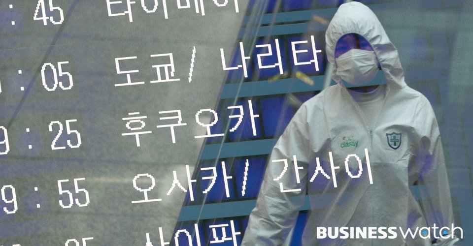
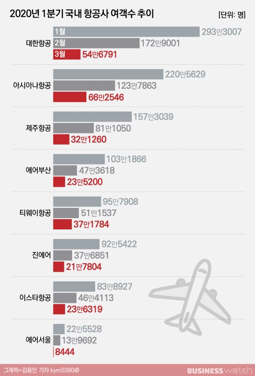

# 항공사, 뼈를 깎는 구조조정으로 버틴다
---

비즈니스워치 2020.04.13

> 항공사 셧다운…국적기 86% 운행 중단  
현금바닥 LLC 한계상황…대형사도 위기감  
"비용 절감외에 위기 극복 방법 없다"

코로나19에 사실상 '셧다운'된 항공업계에는 뼈를 깎는 구조조정이 뒤따르고 있다. 마른수건을 짜는 비용 절감, 고강도 인력 감축뿐만 아니라 일부대형사 중심으로 업계가 재편되는 구조조정까지 진행될 가능성이 높다.

특히 대부분의 저비용항공사(LCC)는 앞으로 6개월 이내에 현금이 바닥나는 상황으로 정부의 지원에서 배제될 경우 최악의 상황에 내몰릴 수밖에 없다. 대형항공사(FSC)도 안심할 수 없다. 아시아나항공은 인수합병 작업이 마무리되기전까지 긴장감을 늦출 수 없고 대한항공은 미국 호텔 계열사 차입금 연장에 차질이 생길 수 있다는 우려도 나온다.

/사진=이명근 기자 qwe123@

항공업계는 <u>코로나19 여파로 수요 절벽에 직면</u>하고 있다. **항공정보포털시스템**에 따르면 이번달 1~12일 여객(국내선·국제선)은 83만6507명으로 전년동기대비 79.5%(324만435명) 감소했다. 여객수는 지난 1월 전년동기대비 0.8% 소폭 늘어난 1069만1326명을 기록한 뒤 코로나19가 본격화된 지난 2월 42.6%, 3월 74.7% 등 매달 급감하고 있다.

부분 항공사는 셧다운 상태다. 이스타항공, 티웨이항공, 에어서울, 에어부산, 플라이강원 등 LCC는 국제선 운항을 전면 중단했다. 대한항공과 아시아나항공, 제주항공, 진에어는 국제선을 유지하고 있지만 코로나19로 입국을 제한한 국가가 많아 상황이 크게 다르지 않다. 370여대의 국적기중 운항에 나서는 것은 50여대에 불과한 것으로 추정되고 있다.

항공사는 본격적인 구조조정에 돌입했다. 이스타항공은 전직원의 5분의 1수준인 300여명을 정리해고 할 계획이다. 대한항공은 전 직원의 70% 가량을 대상으로 오는 16일부터 6개월간 휴업을 실시한다. 아시아나항공의 직원들도 이번달에 최소 15일 이상을 무급휴직에 들어간 상태다.

항공업계는 항공기 리스료, 인건비 등 고정비 부담이 큰 분야다. 항공사는 사실상 셧다운 상태지만 매월 LCC는 400억~500억원, FSC는 2000억원에 달하는 현금이 나가는 것으로 추산되고 있다.

작년말 개별기준 주요 항공사의 '현금·현금성자산'과 '단기금융자산'의 합은 대한항공 1조1458억원, 아시아나항공 3629억원, 진에어 2971억원, 제주항공 2242억원, 티웨이항공 1847억원, 에어부산 462억원, 이스타항공 100억원 등이다. 현금이 가장 부족한 이스타항공부터 정리해고에 들어간 셈이다.

증권업계에선 코로나 사태가 지속되면 항공사 2~6개월 안에 현금성 자산이 바닥나 한계 상황에 이를 것으로 분석하고 있다. 정연승 NH투자증권 연구원은 "2분기내에 수요회복을 기대하기 어렵다"며 "현 시점에서는 국내 항공사는 인력 축소를 포함한 극심한 비용 절감 외에는 위기를 헤쳐나 갈 방법이 없다"고 분석했다.

대형사도 위기감이 감돌긴 마찬가지다.

대한항공은 올해 상환해야할 부채가 3조7500억원이지만 비교적 현금성 자산이 넉넉한 편이고 최근 6000억원 규모의 ABS(유동화증권) 발행에도 성공하며 급한 불은 끈 상태다. 

하지만 코로나 사태가 지속되면 현금이 빠르게 소진될 수 밖에 없다. 최근 우기홍 대한항공 사장은 "한달에 여객 수입이 6000억원이 없어지는 상황"이라며 "지금은 아무리 돈 많은 항공사도 6개월 서 있으면 돈이 안 돌아간다"고 말했다.

미국에서 윌셔그랜드 호텔을 운영하는 미국법인 한진인터내셔널코퍼레이션(이하 HIC)에 대한 유동성 리스크도 우려되고 있다. HIC는 호텔 건설 과정에서 9억 달러를 빌렸는데 이 차입금의 만기가 오는 10월 돌아온다. HIC가 차입금 상환을 못하거나 리파이낸싱에 실패할 경우 불똥은 대한항공에 튄다. HIC의 차입금 전액에 대해 대한항공이 채무보증을 서고 있어서다.

아시아나항공은 HDC현대산업개발과 미래에셋대우로부터 2조1800억원의 자본을 수혈 받을 예정이다. 하지만 코로나 여파로 일정이 꼬이고 있다. 최근 아시아나항공은 두 회사로 대상으로 진행하던 1조4665억원 규모의 유상증자 납입일을 이달 7일에서 사실상 무기한 연장했다.

현대산업개발의 인수 의지는 여전히 강하지만 업계에선 코로나 여파로 미래에셋대우가 이번 딜에서 발을 뺄 것이란 관측도 조심스럽게 제기되고 있다. 아시아나항공은 현대산업개발보다 자산 규모가 2배 더 큰 회사로, 현대산업개발 단독으로 인수를 추진하기는 부담스러운 상황이다.

비즈니스워치 안준형 기자

---

* [참고자료1](https://cizz3007.github.io/%EB%A7%88%ED%81%AC%EB%8B%A4%EC%9A%B4/%EB%AC%B8%EB%B2%95/markdown/2018/04/08/markdown/)  
* [참고자료2](https://heropy.blog/2017/09/30/markdown/)
+ [참고자료3](https://anys4udoc.readthedocs.io/en/latest/attach/doc-markdown.html)
